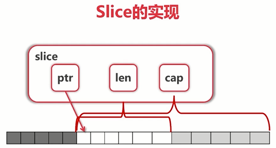

### 常量
1. 常量的名称不需要全部大写，就跟常规的命名一样，小写即可。
2. 常量如果需要导出对外访问，则可以首字母大写
3. const的数值可作为各种类型使用

    常量的类型定义时
    1. 如果定义了类型，则在使用常量的时候就包含类型
    2. 如果未定义类型，则在使用的地方就当字符代码直接替换掉，可以是各种类型，程序会去自动适配

### 条件判断、分支语句
1. if 判断
    1. 不需要使用括号
2. switch 判断
    1. 不需要使用break, 默认每一个都包含break
    2. 如果不想break, 则要是用fallthrough


### 指针
1. GO语言函数传参，只有值传递的一种方式，没有引用传递的说法

### 数组
1. 编译器自动识别数组个数

    arr := [...]int{1,2,3}
2. [10]int和[20]int是不同的类型
3. 数组是值类型的：函数内部的改变对函数外部不可见
    
    调用func f(arr [10]int)会拷贝数组

### 切片

* 向后扩展
```text
arr := [...]int{0,1,2,3,4,5,6,7}    //len=8, cap=8, arr=[0 1 2 3 4 5 6 7]
s1 := arr[2:6]                      //len=4, cap=6, s1=[2 3 4 5]
s2 := s1[3:5]                       //len=2, cap=3, s1=[5 6]
fmt.Println(s2[1])                  //6
fmt.Println(s2[2])                  //panic: runtime error: index out of range [2] with length 2
s1 := arr[2:10]                     //invalid slice index 10 (out of bounds for 8-element array)
```
**注意：**
1. s2[2] => s2长度为2，下标为0和1，超过s2的下标为2，则越界报错
2. arr[2:10] => s2的下标越过底层数组arr的cap，这里cap为8，报错

**原理：**
1. slice可以向后扩展，不能向前扩展
2. s[i] 不可以超越len(s), 向后扩展不可以超越底层数据cap(s)
```text
sli := make([]int, 2, 4)
sli[1] = 1
s1 := sli[1:4]
fmt.Println(s1)     //[1 0 0]
```




* 添加元素
```text
arr := [...]int{0,1,2,3,4,5,6,7}
s1 := arr[2:6]
s2 := s1[3:5]
s3 := append(s2, 10)
s4 := append(s3, 11)
s5 := append(s4, 12)
fmt.Println("s3, s4, s5 = ", s3, s4, s5)    //s3, s4, s5 =  [5 6 10] [5 6 10 11] [5 6 10 11 12]
fmt.Println("arr = ", arr)                  //arr = [0 1 2 3 4 5 6 10]
```
**注意：**
1. s3的最后一位10覆盖了arr的最后一位7

**原理：**
1. 添加元素时如果超越了cap, 系统会重新分配更大的底层数组，并且会将原来的数组拷贝过去
2. 原来的数组如果还有使用，则继续保留；如果没有使用，则系统回收
3. 由于是值传递，因此需要接受append的返回值

